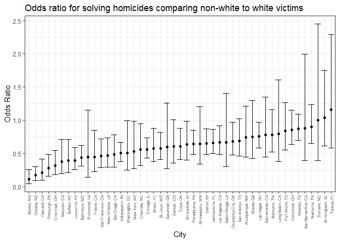

p8105\_hw6\_baw2160
================
Bryce Wong
November 18, 2018

``` r
library(tidyverse)
```

    ## -- Attaching packages ------------------------------------- tidyverse 1.2.1 --

    ## v ggplot2 3.0.0     v purrr   0.2.5
    ## v tibble  1.4.2     v dplyr   0.7.6
    ## v tidyr   0.8.1     v stringr 1.3.1
    ## v readr   1.1.1     v forcats 0.3.0

    ## -- Conflicts ---------------------------------------- tidyverse_conflicts() --
    ## x dplyr::filter() masks stats::filter()
    ## x dplyr::lag()    masks stats::lag()

``` r
library(modelr)
library(mgcv)
```

    ## Loading required package: nlme

    ## 
    ## Attaching package: 'nlme'

    ## The following object is masked from 'package:dplyr':
    ## 
    ##     collapse

    ## This is mgcv 1.8-25. For overview type 'help("mgcv-package")'.

``` r
theme_set(theme_bw() + theme(legend.position = "bottom"))
set.seed(1)
```

### Problem 1:

Loading the data:

``` r
 hom_data = read_csv("https://raw.githubusercontent.com/washingtonpost/data-homicides/master/homicide-data.csv")
```

-   Create a city\_state variable (e.g. “Baltimore, MD”), and a binary variable indicating whether the homicide is solved.
-   Omit cities Dallas, TX; Phoenix, AZ; and Kansas City, MO – these don’t report victim race. Also omit Tulsa, AL – this is a data entry mistake.
-   Modifiy victim\_race to have categories white and non-white, with white as the reference category.
    -   All "unknown" values are "non-white" values with the recoding
-   Be sure that victim\_age is numeric.

``` r
hom_data_tidied = hom_data %>% 
  mutate(city_state = str_c(city, ", ", state)) %>% 
  filter(!(city_state %in% c("Dallas, TX", "Phoenix, AZ", "Kansas City, MO", "Tulsa, AL"))) %>% 
  mutate(resolved = as.numeric(disposition == "Closed by arrest"),
         victim_age = as.numeric(victim_age),
         victim_race = ifelse(victim_race == "White", "white", "non-white"),
         victim_race = fct_relevel(victim_race, "white")) %>% 
  filter(!is.na(victim_age)) %>% 
  select(city_state, resolved, victim_age, victim_race, disposition, everything())
```

    ## Warning in evalq(as.numeric(victim_age), <environment>): NAs introduced by
    ## coercion

-   For the city of Baltimore, MD, use the glm function to fit a logistic regression with resolved vs unresolved as the outcome and victim age, sex and race (as just defined) as predictors.
-   Save the output of glm as an R object; apply the broom::tidy to this object; and obtain the estimate and confidence interval of the adjusted odds ratio for solving homicides comparing black victims to white victims keeping all other variables fixed.

``` r
baltimore_glm = 
  hom_data_tidied %>% 
  filter(city_state == "Baltimore, MD") %>% 
  glm(resolved ~ victim_age + victim_race + victim_sex, data = ., family = binomial()) %>% 
  broom::tidy(conf.int = TRUE) %>% 
  mutate(
    OR = exp(estimate),
    OR_conf.low = exp(conf.low),
    OR_conf.high = exp(conf.high)
    ) %>%
  filter(term == "victim_racenon-white") %>% 
  select(term, log_OR = estimate, OR, OR_conf.low, OR_conf.high, p.value) %>% 
  knitr::kable(digits = 3)

baltimore_glm
```

| term                  |  log\_OR|     OR|  OR\_conf.low|  OR\_conf.high|  p.value|
|:----------------------|--------:|------:|-------------:|--------------:|--------:|
| victim\_racenon-white |    -0.82|  0.441|         0.312|           0.62|        0|

-   Now run glm for each of the cities in your dataset, and extract the adjusted odds ratio (and CI) for solving homicides comparing non-white victims to white victims.
    -   Do this within a “tidy” pipeline, making use of purrr::map, list columns, and unnest as necessary to create a dataframe with estimated ORs and CIs for each city.

``` r
glm_function = function(data, name){
  city_state_glm = data %>% 
  filter(city_state == name) %>% 
  unnest() %>% 
  glm(resolved ~ victim_race + victim_age + victim_sex, data = ., family = binomial()) %>% 
  broom::tidy(conf.int = TRUE) %>% 
  mutate(
    OR = exp(estimate),
    OR_conf.low = exp(conf.low),
    OR_conf.high = exp(conf.high)
    ) %>%
  filter(term == "victim_racenon-white") %>% 
  select(term, log_OR = estimate, OR, OR_conf.low, OR_conf.high, p.value)
  
  city_state_glm
}
```

``` r
all_cities_glm = hom_data_tidied %>% 
  nest(resolved:lon) %>% 
  mutate(
    models = map(.x = city_state, ~glm_function(data = hom_data_tidied, name = .x))
    ) %>% 
  select(city_state, models) %>% 
  unnest()
```

There seems to be an issue wherein fitted probabilities 0 or 1 occurred, meaning that there is a variable that is creating perfect separation in the dependent variable. This might mean that complete regression isn't the best model for this dataset, and that model values may be inflated.

-   Create a plot that shows the estimated ORs and CIs for each city.
-   Organize cities according to estimated OR, and comment on the plot.

``` r
all_cities_glm %>%
  mutate(city_state = fct_reorder(city_state, OR)) %>% 
  ggplot(aes(x = city_state, y = OR)) + 
  geom_point() +
  geom_errorbar(aes(x = city_state, ymin = OR_conf.high, ymax = OR_conf.low)) +
  theme(axis.text.x = element_text(angle = 90, hjust = 1, vjust = 0.5, size = 6)) +
  labs(
    title = "Odds ratio for solving homicides comparing non-white to white victims",
    x = "City",
    y = "Odds Ratio"
  )
```



We can see from this plot that the city with the highest odds ratio for solving homicides comparing non-white to white victims is Tampa, FL, and the city with the lowest odds ratio for solving homicides with this same comparison is Boston, MA.

Most cities seem to have roughly the same odds ratio, as all points are on a roughly flat line. The error bars do seem to vary widely, however. On the whole, most odds ratios are below 1, indicating that the odds of solving homicides with non-white victims is often lower than the odds of solving homicides with white victims.

### Problem 2:

Load data:

``` r
birthweight_data = read_csv("./data/birthweight.csv")
```

    ## Parsed with column specification:
    ## cols(
    ##   .default = col_integer(),
    ##   gaweeks = col_double(),
    ##   ppbmi = col_double(),
    ##   smoken = col_double()
    ## )

    ## See spec(...) for full column specifications.

Clean data:

``` r
birthweight_data = birthweight_data %>% 
  mutate(
    babysex = as.factor(babysex),
    frace = as.factor(frace),
    malform = as.factor(malform),
    mrace = as.factor(mrace)
  ) 
```

I begin building a proposed regression model for birthweight by starting with all predictors in the model:

``` r
birthweight_full = lm(bwt ~ babysex + bhead + blength + delwt + fincome + frace + gaweeks + malform + menarche + mheight + momage + mrace + parity + pnumlbw + pnumsga + ppbmi + ppwt + smoken + wtgain, data = birthweight_data)

birthweight_full_tidy = birthweight_full %>% 
  broom::tidy() %>% 
  select(term, estimate, p.value) %>% 
  knitr::kable(digits = 3)

birthweight_full_tidy
```

| term        |   estimate|  p.value|
|:------------|----------:|--------:|
| (Intercept) |  -6265.391|    0.000|
| babysex2    |     28.707|    0.001|
| bhead       |    130.778|    0.000|
| blength     |     74.954|    0.000|
| delwt       |      4.101|    0.000|
| fincome     |      0.290|    0.107|
| frace2      |     14.331|    0.756|
| frace3      |     21.236|    0.759|
| frace4      |    -46.996|    0.293|
| frace8      |      4.297|    0.954|
| gaweeks     |     11.549|    0.000|
| malform1    |      9.765|    0.890|
| menarche    |     -3.551|    0.220|
| mheight     |      9.787|    0.343|
| momage      |      0.759|    0.534|
| mrace2      |   -151.435|    0.001|
| mrace3      |    -91.387|    0.204|
| mrace4      |    -56.479|    0.211|
| parity      |     95.541|    0.018|
| ppbmi       |      4.354|    0.770|
| ppwt        |     -3.472|    0.184|
| smoken      |     -4.854|    0.000|

Here are the variables that weren't statistically significant when they were a part of the full model:

-   fincome
-   frace2-frace8 (missing frace5-7)
-   malform1
-   menarche
-   mheight
-   momage
-   mrace3, mrace4
-   parity
-   ppbmi
-   ppwt

N/A - might mean these variables aren't linearly independent:

-   pnumlbw
-   pnumsga
-   wtgain

I removed these variables and fit a new regression model:

``` r
birthweight_2 = lm(bwt ~ babysex + bhead + blength + delwt + gaweeks + mrace + smoken, data = birthweight_data)

birthweight_2_tidy = birthweight_2 %>% 
  broom::tidy() %>% 
  select(term, estimate, p.value) %>% 
  knitr::kable(digits = 3)

birthweight_2_tidy
```

| term        |   estimate|  p.value|
|:------------|----------:|--------:|
| (Intercept) |  -5814.273|    0.000|
| babysex2    |     29.223|    0.001|
| bhead       |    131.863|    0.000|
| blength     |     75.800|    0.000|
| delwt       |      2.267|    0.000|
| gaweeks     |     11.866|    0.000|
| mrace2      |   -146.884|    0.000|
| mrace3      |    -71.687|    0.092|
| mrace4      |   -120.046|    0.000|
| smoken      |     -4.752|    0.000|

I decided to then add back in variables I think make theoretical sense:

-   ppwt
-   ppbmi

Looking at ppbmi and ppwt, each seems to not be significant when the other is in the model. They are also both non-significant when testing for an interaction between the two. I'm considering ppbmi more important, so I remove ppwt from the model. This is because BMI may be a more accurate measurement of one's health than simply weight (although BMI can be potentially problematic as well).

Testing for possible interactions (including some previously excluded variables in case they become statistically significant in the model when included in an interaction):

-   head circumference with length at birth
-   delivery weight with gestational age
-   mom's race with smoking
-   mom's race and income
-   father's race and income

``` r
birthweight_3 = lm(bwt ~ babysex + bhead * blength + delwt * gaweeks + mrace * smoken + ppbmi + mrace * fincome + frace * fincome, data = birthweight_data)

birthweight_3_tidy = birthweight_3 %>% 
  broom::tidy() %>% 
  select(term, estimate, p.value) %>% 
  knitr::kable(digits = 3)

birthweight_3_tidy
```

| term           |   estimate|  p.value|
|:---------------|----------:|--------:|
| (Intercept)    |  -3790.666|    0.000|
| babysex2       |     30.235|    0.000|
| bhead          |     59.009|    0.015|
| blength        |     25.071|    0.133|
| delwt          |      6.749|    0.004|
| gaweeks        |     23.570|    0.007|
| mrace2         |    -72.412|    0.453|
| mrace3         |    111.136|    0.569|
| mrace4         |     33.862|    0.739|
| smoken         |     -5.225|    0.000|
| ppbmi          |    -12.561|    0.000|
| fincome        |      0.814|    0.000|
| frace2         |    -11.937|    0.902|
| frace3         |    -32.146|    0.863|
| frace4         |    -59.102|    0.562|
| frace8         |     -7.846|    0.951|
| bhead:blength  |      1.502|    0.003|
| delwt:gaweeks  |     -0.079|    0.180|
| mrace2:smoken  |      2.123|    0.160|
| mrace3:smoken  |    -14.956|    0.318|
| mrace4:smoken  |      2.181|    0.487|
| mrace2:fincome |     -2.204|    0.347|
| mrace3:fincome |     -4.020|    0.338|
| mrace4:fincome |     -2.405|    0.298|
| fincome:frace2 |      0.791|    0.736|
| fincome:frace3 |      0.936|    0.821|
| fincome:frace4 |      0.379|    0.871|
| fincome:frace8 |      0.829|    0.784|

Only the interaction between head circumference and length at birth seemed significant - length seemed non-significant on it's own at this point.

``` r
birthweight_4 = lm(bwt ~ babysex + bhead + bhead:blength + delwt + gaweeks + mrace + smoken + ppbmi, data = birthweight_data)

birthweight_4_tidy = birthweight_4 %>% 
  broom::tidy() %>% 
  select(term, estimate, p.value) %>% 
  knitr::kable(digits = 3)

birthweight_4_tidy
```

| term          |   estimate|  p.value|
|:--------------|----------:|--------:|
| (Intercept)   |  -2132.160|    0.000|
| babysex2      |     31.613|    0.000|
| bhead         |     23.897|    0.000|
| delwt         |      3.557|    0.000|
| gaweeks       |     12.536|    0.000|
| mrace2        |   -141.842|    0.000|
| mrace3        |    -74.720|    0.077|
| mrace4        |   -102.230|    0.000|
| smoken        |     -4.760|    0.000|
| ppbmi         |    -12.464|    0.000|
| bhead:blength |      2.250|    0.000|

Comparing nested models - the full to the new one:

``` r
anova(birthweight_4, birthweight_full) %>% 
  broom::tidy()
```

    ## Warning: Unknown or uninitialised column: 'term'.

    ## # A tibble: 2 x 6
    ##   res.df        rss    df   sumsq statistic p.value
    ## *  <dbl>      <dbl> <dbl>   <dbl>     <dbl>   <dbl>
    ## 1   4331 321604175.    NA     NA      NA     NA    
    ## 2   4320 320724338.    11 879837.      1.08   0.375

My proposed model doesn't seem to be significantly different from the full one, which means my proposed model is not necessarily the best model.

Graphing the residuals and predictions of the proposed regression model:

``` r
birthweight_data %>% 
  modelr::add_residuals(birthweight_3) %>% 
  modelr::add_predictions(birthweight_3) %>% 
  gather(key = diagnostics, value = value, resid:pred) %>% 
  ggplot(aes(x = bwt, y = value, color = diagnostics)) + 
  geom_point() +
  labs(
    title = "Predictions and Residuals",
    x = "Birthweight",
    y = "Predictions and Residuals"
  ) 
```


The predictions show a positive, linear trend, indicating that the model is predicting similar birthweights to the actual birthweight data. The residuals are all basically centered around 0, indicating not too much prediction errors. However, the spread is pretty wide around this 0, so it's likely this is not the most accurate of predictive models.

Compare your model to two others:

-   One using length at birth and gestational age as predictors (main effects only)
-   One using head circumference, length, sex, and all interactions (including the three-way interaction) between these

The comparison is done below:

-   Created a cross-validation training and testing sets
-   Fit my proposed model and the two comparison models to the training sets and then validated using the testing sets
-   Took a look at the generated RSMEs for each model

``` r
cv_birthweight = crossv_mc(birthweight_data, 100)

cv_birthweight = 
  cv_birthweight %>% 
  mutate(
    proposed_mod = map(train, ~lm(bwt ~ babysex + bhead + blength + delwt + gaweeks + mrace + smoken + ppbmi, data = .x)),
    length_ga_mod = map(train, ~lm(bwt ~ blength + gaweeks, data = .x)),
    circ_length_sex_mod = map(train, ~lm(bwt ~ bhead * blength * babysex, data = .x))) %>% 
  mutate(
    rmse_proposed = map2_dbl(proposed_mod, test, ~rmse(model = .x, data = .y)),
    rmse_length_ga = map2_dbl(length_ga_mod, test, ~rmse(model = .x, data = .y)),
    rmse_circ_length_sex = map2_dbl(circ_length_sex_mod, test, ~rmse(model = .x, data = .y)))
```

Model RMSEs:

``` r
cv_birthweight %>% 
  select(starts_with("rmse")) %>% 
  gather(key = model, value = rmse) %>% 
  mutate(model = str_replace(model, "rmse_", ""),
         model = fct_inorder(model)) %>% 
  ggplot(aes(x = model, y = rmse, fill = model)) + geom_violin() +
  labs(
    title = "RMSEs by Model",
    x = "Model",
    y = "RMSE"
  )
```


It appears that my proposed model has the lowest root mean square error of all the models, indicating that this one has the lowest average prediction error. This could mean that this model has performed the best, although whether this difference in performance is statistically significant has not been tested.
